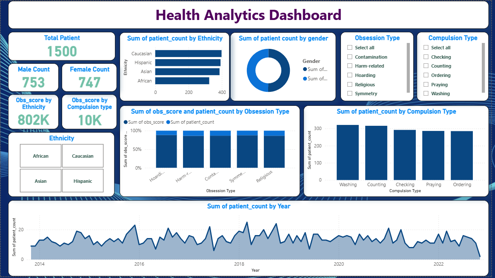

# Health Analytics Dashboard — Power BI & SQL

This project presents an interactive **Health Analytics Dashboard** built in **Power BI**, where I analyze key demographic, behavioral, and clinical patterns of patients using structured SQL-prepared data. The dashboard provides a comprehensive view of **patient counts**, **obsession and compulsion types**, **gender distribution**, **ethnicity breakdowns**, and **yearly patient trends**.

  
  
---

## Project Summary

The main objective of this project is to transform raw OCD-related patient data into meaningful insights by leveraging:

* **SQL** for data cleaning and transformation
* **Power BI** for modeling, visual analytics, and dashboard creation

The final dashboard enables healthcare professionals and analysts to explore:

* Patient demographics
* Ethnicity-based trends
* Obsession & compulsion behavior patterns
* Long-term patient trends
* Count-based KPIs used in clinical decision-making

---

## Dashboard Overview

The dashboard consists of multiple key insight sections derived directly from the dataset:

### Key Metrics

* **Total Patients:** 1500
* **Male Patients:** 753
* **Female Patients:** 747
* **Total Obsession Score by Ethnicity:** 802K
* **Total Obsession Score by Compulsion Type:** 10K

These KPIs provide a quick snapshot of demographic distribution and behavioral intensity.

---

### Patient Distribution by Ethnicity

A horizontal bar chart displays patient counts across major ethnic groups:

* Caucasian
* Hispanic
* Asian
* African

This helps identify demographic representation and potential disparities in OCD prevalence.

---

### Gender Distribution

A donut chart comparing:

* **Female (49.8%)**
* **Male (50.2%)**

Gender distribution is almost perfectly balanced, providing unbiased analysis potential.

---

### Obsession Type Analysis

Includes:

* Filters for Contamination, Harm-related, Hoarding, Religious, Symmetry
* A comparison chart showing **obs_score vs patient_count** for each obsession type

This section helps identify which obsession categories show higher symptom severity.

---

### Compulsion Type Analysis

A bar chart showing patient count for:

* Washing
* Counting
* Checking
* Praying
* Ordering

Along with a slicer to explore details by compulsion category.

---

### Ethnicity Slicer

An interactive tile-style slicer enabling quick filtering of visuals for:

* African
* Caucasian
* Asian
* Hispanic

---

### Yearly Patient Trend (2014–2023)

A continuous line visualization representing yearly patient count trends.

This identifies:

* Growth patterns
* Behavioral shifts over the years
* Possible seasonal/annual variations

---

## Data Processing (SQL)

Before importing into Power BI, data was prepared using SQL:

* Cleaned missing & inconsistent values
* Standardized demographic fields
* Created new analytical columns (e.g., yearly patient count, obsession totals)
* Aggregated obsession and compulsion scores
* Generated patient-level summaries

The cleaned SQL tables were then loaded into Power BI for modeling and visualization.

---

## Tools & Technologies Used

| Tool/Language      | Purpose                                             |
| ------------------ | --------------------------------------------------- |
| **Power BI**       | Data modeling, DAX measures, interactive dashboards |
| **SQL**            | Data cleaning, transformations, aggregation         |
| **Kaggle Dataset** | OCD-related clinical and demographic data           |
| **DAX**            | KPI calculations, obsession/compulsion metrics      |

---

## 📂 Dataset Source

This dashboard uses the following public dataset:

**OCD Patient Dataset — Demographics & Clinical Data**
🔗 (https://www.kaggle.com/datasets/ohinhaque/ocd-patient-dataset-demographics-and-clinical-data/)]

---

## 📁 Repository Structure

```
📦 Health-Analytics-Dashboard
├── Dashboard.pbix
├── SQL/
│   ├── cleaning_script.sql
│   ├── transformations.sql
├── Images/
│   └── health_dashboard.png
└── README.md
```

---

## Key Outcomes

* Built a fully interactive, multi-filter healthcare dashboard
* Analyzed demographic and behavioral patterns in OCD patients
* Developed SQL pipelines for structured analytic modeling
* Created meaningful KPIs for clinical and administrative insight
* Strengthened Power BI skills in slicers, DAX, and visual storytelling

---

## Contact


**Nuren Sherpa**
**GitHub:** *(https://github.com/sherpanuren)*
**LinkedIn:** *https://www.linkedin.com/in/nurensherpa/*
